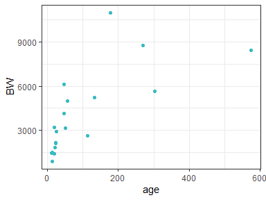
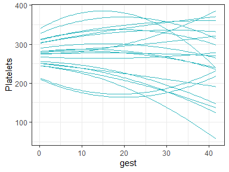
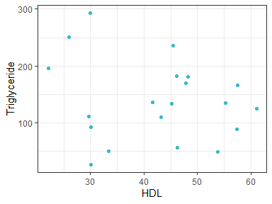

<!-- README.md is generated from README.Rmd. Please edit that file -->

# Virtual patient simulation using copula modeling

These scripts were used to study the suse of copulas for simulation of
virutal patient sets.

### Scripts

The folder scripts contains the following files:

-   **simulation_comparison.R**, contains the data prepation of the
    pediatric data and the analysis of a three-covariate simulation for
    five different simulation techniques (Figure 2a)
-   **simulation_comparison_12d.R**, uses prepared data from
    simulation_comparison.R and simulates 12 covariates using the same
    five simulation techniques (Figure 2b)
-   **PK_model_simulation.R**, uses prepared data from
    simulation_comparison.R. The three-covariate simulations are used to
    predict vancomycin PK profiles (Figure 3a and 3b)
-   **data_preparation_pregnancy.R**, prepares pregnancy data for the
    time-dependent covariates
-   **longitudinal_copulas.R**, uses prepared data from
    data_preparation_pregnancy.R (Figure 4).
-   **data_preparation_MIMIC.R**, extracts columns of interest from the
    large MIMIC database. *requires large memory*
-   **MIMIC_copula.R**, uses prepared data from data_preparation_MIMIC.R
    estimates and visualizes simulations from a copula on the MIMIC data
    (Figure 5 and S2). *requires large memory*

#### Functions

Above scripts depend on certain functions written in separate files.

-   **functions.R**, contais a set of helpers functions used throughout
    the project: `create_colors`, `tranform_to_uniform`,
    `estimate_spline_marginal`, `get_statistics_multiple_sims` and
    `get_statistics`.
-   **estimate_vinecopula.R**, contains a wrapper function for the
    `rvinecopula` package for estimation of copulas. Can be used on
    untrasformed data and uses kernel density estimation for the
    marginal distributions. Creates an object which can be used to
    simulate new covariate sets.
-   **Smania_Jonsson_MICE_simulation.R**, retrieved from the article
    Smania & Jonsson (2021). Contains function for conditional
    distribution simulation.
-   **run_Grimsley.R**, contains the `run_grimsley` function which
    implements the vancomycin PK model from Grimsley & Thomson (1999).
    Used for PK_model_simulation.R.
-   **plot_distributions.R**, plot the contours from simulated and
    observed data. Used for MIMIC_copula.R -\> Figure 5 and S2.

### Data

The copulas were added which can be used to simulate data and explore
the data underlying the study, without sharing the underlying data. Use
below code to load and start simulating.

``` r
library(rvinecopulib)
library(tidyverse)

source("scripts/functions/estimate_vinecopula_from_data.R")
source("scripts/functions/functions.R")
source("scripts/functions/plot_distributions.R")
```

#### Pediatric data

``` r
load("copulas/pediatric_copula.Rdata")
df_sim_pediatric <- simulate(large_cop, n = 20, value_only = FALSE)
ggplot(data = df_sim_pediatric) +
  geom_point(aes(x = age, y = BW), color = "#3ABAC1") +
  theme_bw()
```



#### Longitudinal data

``` r
load("copulas/longitudinal_copula.Rdata")
df_sim_longitudinal <- simulate(copula_long, n = 20, value_only = FALSE)
ggplot(data = df_sim_longitudinal$values) +
  geom_line(aes(x = gest, y = Platelets, group = ID), color = "#3ABAC1") +
  theme_bw()
```



#### MIMIC data

The MIMIC data can be retrieved from
<https://physionet.org/content/mimiciv/1.0/>.

``` r
load("copulas/mimic_copula.Rdata")
df_sim_mimic <- simulate(cop_mimic, n = 20, value_only = FALSE)
ggplot(data = df_sim_mimic) +
  geom_point(aes(x = HDL, y = Triglyceride), color = "#3ABAC1") +
  theme_bw()
```


